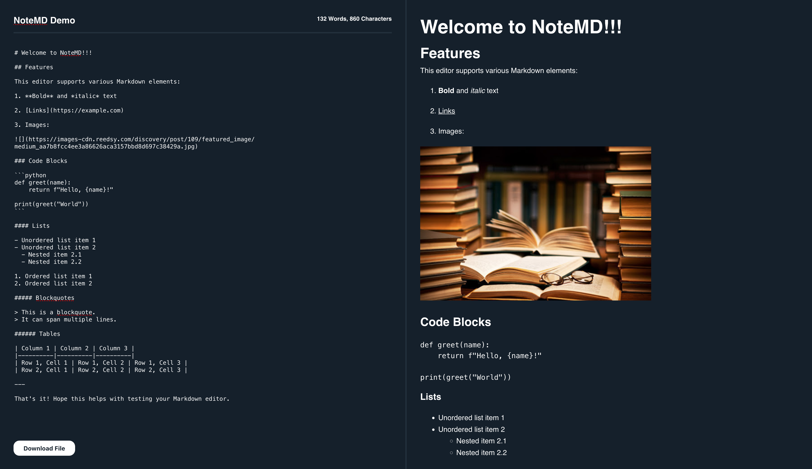
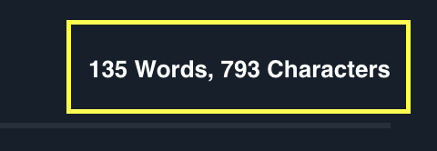
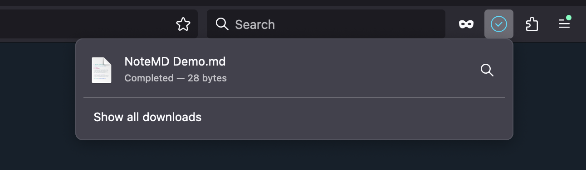

# NoteMD - Markdown Editor w/ Live Preview

## Overview

NoteMD is a Markdown Editor with real-time character and word count, live HTML preview, and a download feature. The application dynamically converts Markdown input into HTML and allows users to download the content as a `.md` file. It’s designed to work seamlessly on `localhost:8080`.

## Tech Stack

**Go**: Currently used to serve the app on localhost:8080, and will play a major role in the backend for future features.
Vanilla **JavaScript**: Handles the frontend logic, including real-time Markdown to HTML conversion and file downloads.
**CSS**: For styling the editor and preview panels.
**HTML**: Provides the basic structure of the web application.

## Features

- **Live Markdown Editing**: Type your Markdown content in the editor panel.
- **Real-time Character & Word Count**: Automatically updates with each keystroke.
- **Live HTML Preview**: Converts Markdown to HTML instantly as you type.
- **Markdown Download**: Download your Markdown content as a `.md` file with a custom filename.

## Usage

### Markdown Editor Panel

- **Headers**: `# Header1`, `## Header2`, etc.
- **Bold and Italics**: `**Bold**`, `_Italic_`
- **Links**: `[Link text](URL)`
- **Code Blocks**: ```` ``` `code` ``` ````

### HTML Preview Panel



As you type, your Markdown will be converted to HTML and displayed in real-time.

### Character & Word Count



Word and character counts update dynamically as you type, displayed below the editor.

### Download Button


After editing, click the **Download** button to save your Markdown content as a `.md` file.



The filename is derived from the document's title, or it defaults to `Title.md`.

## Getting Started

### Prerequisites

Make sure you have the following installed:

- **Go**: To run the server locally.
- Any modern browser (Chrome, Firefox, etc.).

### Installation

1. **Clone the repository**:
    ```bash
    git clone https://github.com/bilosman/notes-md.git
    ```

2. **Navigate into the project directory**:
    ```bash
    cd notes-md
    ```

3. **Run the Go server**:
    ```bash
    go run main.go
    ```

4. Open your browser and navigate to:
    ```
    http://localhost:8080
    ```

## Future Features

1. **Custom Themes**: Allow users to select different color themes (e.g., Dark Mode, Solarized).
2. **Export to PDF/HTML**: Support exporting the document as PDF or HTML files.
3. **Markdown Syntax Highlighting**: Implement live syntax highlighting.
4. **Auto-Save**: Persist Markdown text between sessions using `localStorage`.
5. **Real-time Collaboration**: Enable multiple users to edit documents simultaneously using Go and WebSockets.
6. **Offline Support**: Add offline capabilities with service workers for better user experience without an internet connection.
7. **Mobile-Friendly Interface**: Improve responsiveness for mobile devices.

## Future Plans for Go

In the future, **Go** will play a central role in the backend of the application, including:

1. **Server-side Markdown Rendering**: Offload Markdown parsing to the Go server for better performance, especially for larger documents.
2. **Database Integration**: Use Go to connect to a database (PostgreSQL or MongoDB) for saving, retrieving, and managing Markdown documents.
3. **API Development**: Build an API for users to interact with their Markdown files programmatically, allowing collaboration and versioning.
4. **Authentication and Authorization**: Add user authentication and role-based access using Go for secure editing and file management.


## Contributing

1. Fork the project.
2. Create your feature branch (`git checkout -b feature/AmazingFeature`).
3. Commit your changes (`git commit -m 'Add some amazing feature'`).
4. Push to the branch (`git push origin feature/AmazingFeature`).
5. Open a pull request.
